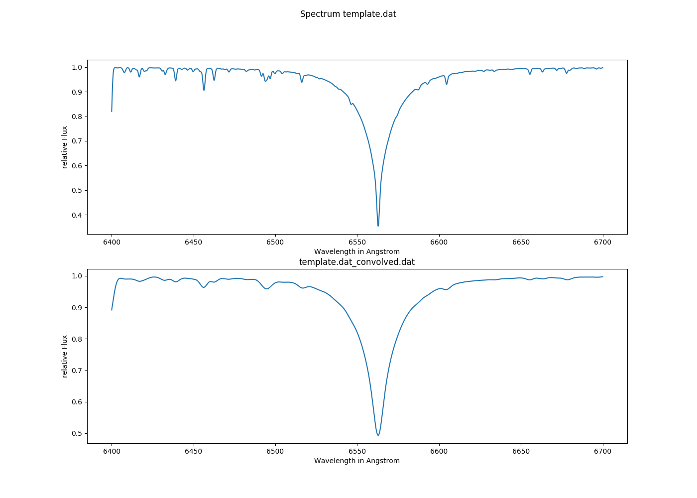
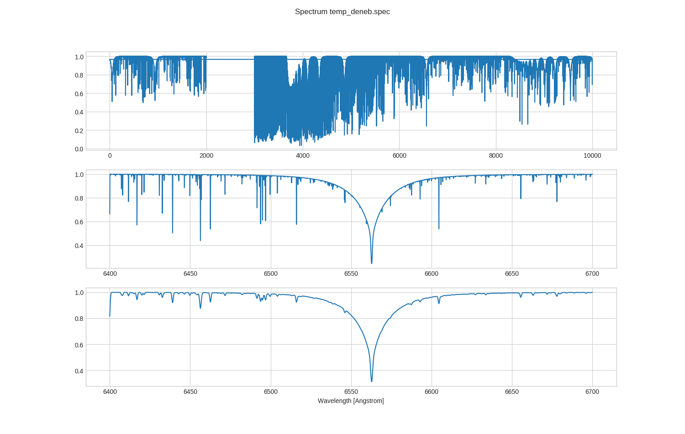
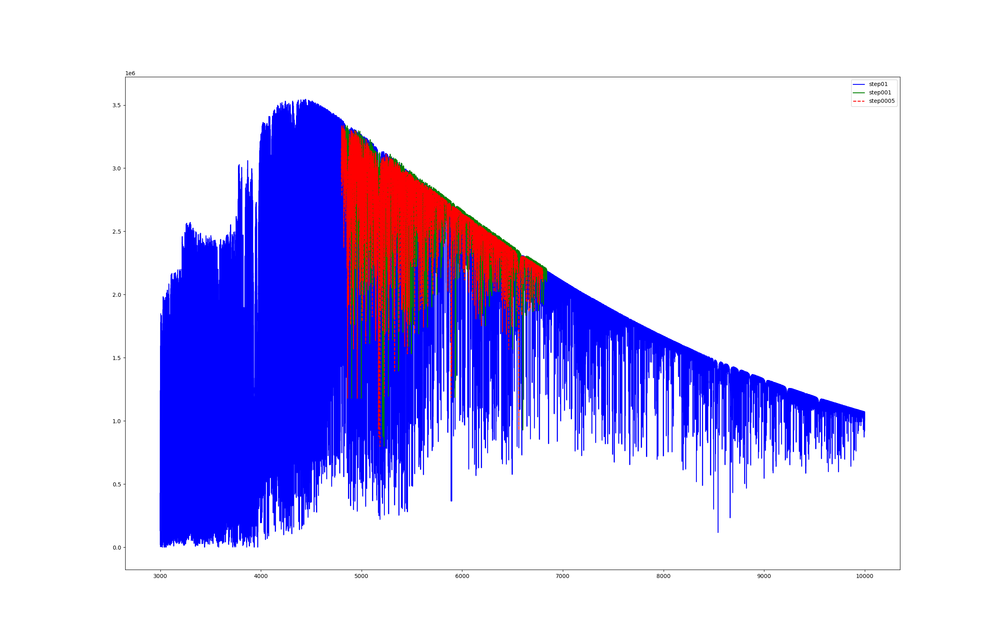

# 降低分辨率

## 简介

『降低分辨率』多用于不同分辨率光谱的比较上，主要是将较高的分辨率光谱（如理论合成光谱）降低至较低的观测光谱分辨率（如 SDSS, LAMOST）。

降低分辨率在文章的数据处理部分中多被描述为 "degrade the spectral resolution" 或者 "convolve the spectra using Gaussian Kernel"。

## 方法

该步骤实际上就是用一个一维高斯滤波器对一维光谱进行卷积操作，起到模糊平滑的作用。

::: warning
笔者在最初操作中，将『降低分辨率』与『下采样』的概念混淆。在与导师的沟通交流中，也了解到有学生在论文中犯过同样的错误。
:::

『下采样』是对一个序列间隔几个样值采样一次，e.g. `[1, 1, 2, 2, 3, 3]` 如果间隔 step = 2 进行采样，则新序列为 `[1, 2, 3]`。

## 最佳实践

在实际的光谱处理中，我们需要『具体问题具体分析』，针对不同的光谱仪器特征，或是科学目的、实验精度等，对光谱进行特定的降低分辨率操作。

下面以 4 个例子进行讲解，实验代码均在 Python 3 下运行。

**笔者对第 ③ 个 LAMOST 的例子进行了详细的代码注解。**

### ① 基本操作

> 详情请参考 [Convolution of 1d-spectra with Gaussian functions](https://lotharschanne.wordpress.com/convolution-of-1d-spectra-with-gaussian-functions/)

```python
import matplotlib.pyplot as plt
from astropy.convolution import Gaussian1DKernel
from astropy.convolution import convolve
from astropy.io import ascii

spectrum_name = input('Path and name of the file: ')

std = float(input('Standard deviation for the convolution in multiples of the\
 increment: '))

# Spektrum einlesen
spectrum = ascii.read(spectrum_name, guess=True)

#   Convolve using astropy.convolution
kernel = Gaussian1DKernel(stddev=std)
convoluted = convolve(spectrum['FLUX'], kernel, normalize_kernel=True,
                      boundary='extend')

name = spectrum_name+'_convolved.dat'

# Graphics
fig = plt.figure(1, figsize=(14, 10))
plt.suptitle('Spectrum '+spectrum_name)
plt.subplot(2, 1, 1)
plt.plot(spectrum['WAVE'], spectrum['FLUX'])
plt.xlabel('Wavelength in Angstrom')
plt.ylabel('relative Flux')
plt.subplot(2, 1, 2)
plt.plot(spectrum['WAVE'], convoluted)
plt.xlabel('Wavelength in Angstrom')
plt.ylabel('relative Flux')
plt.title(name)
# saving graphics
plt.savefig(name+'.png')
plt.savefig(name+'.pdf')

# Saving of convolved
ascii.write([spectrum['WAVE'], convoluted], name, overwrite=True,
            names=['WAVE', 'FLUX'], format='tab')
```



### ② 处理 POLLUX 模型光谱

> 详情请参考 [Processing POLLUX model spectra](https://lotharschanne.wordpress.com/processing-of-pollux-model-spectra/)
>
> POLLUX 是一个高分辨率的理论合成光谱库

```python
import numpy as np
import matplotlib.pyplot as plt
import pandas as pd
from astropy.convolution import Gaussian1DKernel
from astropy.convolution import convolve
from astropy.io import ascii

file = input('path and name of the file: ')
lambda_min = float(input('Input of the start wavelength in the spectrum: '))
deltalambda = float(input('Input of the step in the spectrum: '))
std = float(input('Standard deviation for the convolution in multiples of the\
 increment: '))

table = pd.read_fwf(file, names=['WAVE', 'AFLUX', 'NFLUX'], header=0)

wl_li = int(input('Begin of Wavelength range: '))
wl_re = int(input('End of Wavelength range: '))
ind_li = int((wl_li-lambda_min) / deltalambda)
ind_re = int((wl_re-lambda_min) / deltalambda)
bereich = table[ind_li:ind_re]

#   Convolve using astropy.convolution
kernel = Gaussian1DKernel(stddev=std)
con = np.array(bereich['NFLUX'])
convoluted = convolve(con, kernel, normalize_kernel=True,
                      boundary='extend')

# Graphics
plt.style.use('seaborn-whitegrid')
fig, ax = plt.subplots(3)
fig.set_size_inches(15, 15)
plt.xlabel('Wavelength [Angstrom]')
fig.suptitle('Spectrum '+file)
plt.grid(True)
ax[0].plot(table['WAVE'], table['NFLUX'])
ax[1].plot(bereich['WAVE'], bereich['NFLUX'])
ax[2].plot(bereich['WAVE'], convoluted)
plt.savefig(file+'.png')
plt.savefig(file+'.pdf')

# Save convoluted spectrum, NFLUX now as FLUX
convol_file = pd.DataFrame(bereich['WAVE'], convoluted,
                           columns=['WAVE', 'NFLUX'])
name = file.rstrip('.spec')+'_convolved.dat'
ascii.write([bereich['WAVE'], convoluted], name, overwrite=True,
            names=['WAVE', 'FLUX'], format='tab')
```



### ③ 降至 LAMOST 光谱的低分辨率

> 实验中用到的分辨率为 50,000 的光谱 ​[:green_book: 下载链接]()

```python
import numpy as np
import scipy.signal
from scipy.ndimage import gaussian_filter1d
from scipy import interpolate
import matplotlib.pyplot as plt


def conv(origin_flux, old_resolution, new_resolution, step):
    """ degrade spectral resolution in LAMOST scale
    :param origin_flux: the original flux of high spectral resolution
    :param old_resolution: high resolution
    :param new_resolution: low resolution
    :param step: the step of original spectra wavelength
    :return: the degraded flux of low resolution
    """
    # 5000 angstrom is the approximate central wavelength of LAMOST
    # 2.355 is the constant of the transformation from FWHM (i.e. delta lambda) to sigma
    sigma = np.sqrt((5000. / new_resolution) ** 2 - (5000. / old_resolution) ** 2)/(2.355 * step)
    # use gaussian kernel to degrade the spectra
    degraded_flux = gaussian_filter1d(origin_flux, sigma)
    return degraded_flux


if __name__ == '__main__':
    # 读取原始光谱文件
    data = np.loadtxt('ap00t5777g44377k1odfnew_50000.spec')
    wave_01 = data[:, 0]  # 原始波长的步长间隔为 0.1 angstrom
    flux_01 = data[:, 1]

    # 对光谱进行插值，分别将流量插值到波长的步长间隔为 0.01 和 0.005
    # 同时，为了方便展示，只截取 [4800, 6800] 这一段波长
    wave_001 = np.arange(4800, 6800, 0.01)
    flux_001 = interpolate.interp1d(wave_01, flux_01)(wave_001)
    wave_0005 = np.arange(4800, 6799.99, 0.005)
    flux_0005 = interpolate.interp1d(wave_01, flux_01)(wave_0005)

    # 分别对步长为 0.01 和 0.005 的流量降低分辨率
    flux_001_degrade = conv(origin_flux=flux_001, old_resolution=50000,
                            new_resolution=7500, step=0.1)
    flux_0005_degrade = conv(origin_flux=flux_0005, old_resolution=50000,
                             new_resolution=7500, step=0.005)

    # 画图
    plt.figure(figsize=(25, 16))
    plt.plot(wave_01, flux_01, 'b-', label='step01')
    plt.plot(wave_001, flux_001_degrade, 'g-', label='step001')
    plt.plot(wave_0005, flux_0005_degrade, 'r--', label='step0005', alpha=1.0)
    plt.legend()
    plt.show()
```



### ④ 降低不等间隔波长步长的光谱分辨率

> 详情请参考 [convolve_spectra](https://github.com/jason-neal/convolve_spectrum)

